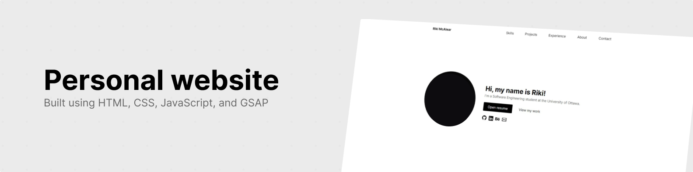

<h1>Personal Website</h1>

    
    
    

<h2>Introduction</h2>

This is a website built by yours truly to breathe life into my original CV. It visualizes my skills, projects, experience, about, and contact information.

<a href="https://riku737.github.io/" target="_blank">View website</a>

<h2>Technologies</h2>

<h2>Features</h2>
<ul>
  <li>Component-based architecture and modular web components 📐</li>
  <li><a href="https://github.com/cure53/DOMPurify" target="_blank">DOMPurify</a> HTML sanitization and XSS attack prevention 🛡️</li>
  <li>Mobile responsive web design 📱</li>
  <li>Web accessible sizing based on W3C recommendations ♿</li>
  <li>HTML semantic elements 🏷️</li>
  <li>GSAP animations 🎥</li>
  <li>CSS animations 🎨</li>
  <li>Interactive web elements 🖱️</li>
  <li>WebM video and WebP image supported formats 📹</li>
  <li>Google embed web fonts (Inter and Space Grotesk) 🔤</li>
  <li>Bootstrap icons 🖌️</li>
  <li>CSS Pseudo-elements 🎭</li>
  <li>Error 404 page 🚫</li>
</ul>
